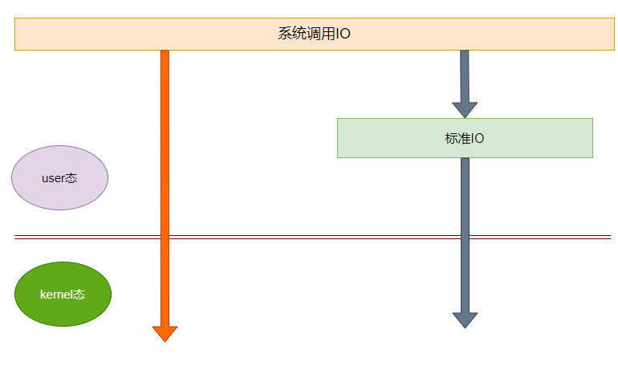
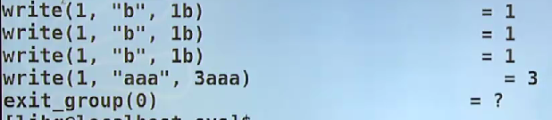
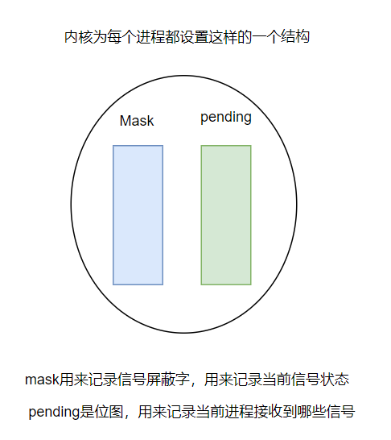
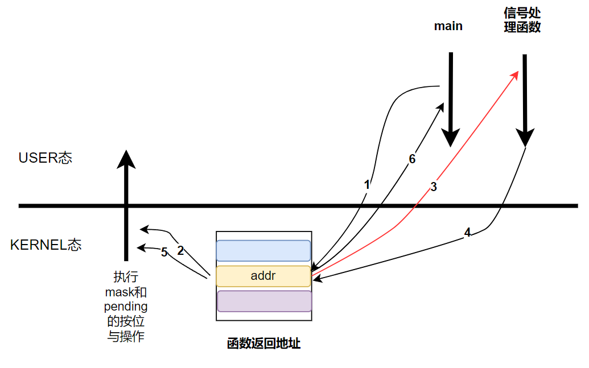

# c语言系统开发

## 李慧琴linux嵌入式C语言编程

- [ ] 谁打开谁关闭
- [ ] 谁申请谁释放
- [ ] 是资源就一定有上限


> 共用体

同一个存储空间可以存储多种数据类型，但是同一时刻只能一个成员存在，空间大小由最大的数据类型所占空间大小

> 位域

> ### makefile文件编写 (make工程管理器)

对于多级的项目结构，运行前的编译工作，通过多级makefile文件的方式进行编译工作,全过程相当于从叶子往根进行遍历

> **俄罗斯方块实现**

**1、碰到的问题**

- 图形（画图问题）
- 对输入设备的设置问题（不要让用户输入的WASD显示到终端）
- 并发问题（下降同时接收键盘输入）


> ## UNIX环境高级编程

### **全书结构拆解**  3~16章(9章)

> I/O：

3、5章 14章

> 文件系统：

4、6、7章

> 并发：

信号 10章

多进程、多线程  10、11章

> IPC:进程间通信

8章 进程基础（涉及到多进程）

13章 守护进程

15、16章


注意事项：

1、弃用root用户

2、重构之前的代码

3、基于：项目、课堂代码、面试题、实验性题目、推荐书籍的课后题


> ## 时间表

| 时间 |       内容       |
| :--: | :--------------: |
| 8/11 |      标准IO      |
| 8/12 |    系统调用IO    |
| 8/13 |     文件系统     |
| 8/14 |  目录和用户操作  |
| 8/15 |     进程专题     |
| 8/16 |     信号专题     |
| 8/17 |     线程专题     |
| 8/18 |      高级IO      |
| 8/19 |     管道实例     |
| 8/20 | 进、线程通信专题 |
| 8/21 |   网络编程专题   |

## 一、标准I/O操作

**io操作是一切实现的基础**，对于数据可以存储，转存进文件中，需要时从文件中拿出，所以是一切操作基础。

系统调用io（sysio），标准IO(stdio)，不同的操作系统环境下，同一个函数依赖的是不同的系统调用，所以才需要标准IO，不管是什么操作系统，底层的输入输出到底是怎么实现的，所有的标准IO在任何操作系统下，参数相同，返回值以及调用方法完全一致，所以就解决了不同系统下输入输出方法不相匹配的问题，比如不论是什么系统，printf函数用法完全一致。标准IO移植性好。所以在任何的操作系统下，标准IO依赖于系统调用IO实现。




**标准IO（stdio）：FILE 类型贯穿始终**

`FILE实际上是一个结构体`

> 查看man手册:man ls

常见文件操作函数：

## 1、打开关闭函数

`fopen()`

```c
FILE *fopen(const char *pathname, const char *mode);
```

第一个参数是需要打开的文件名称，第二个参数是打开的模式。

`errno`->相当于一个全局变量，如果当前有一个操作出现错误，那么计算机会将错误原因放在errno里，所以需要及时将errno中的信息打印出来，如果没有及时打印，当前的errno里面的信心可能会被其他的错误信息覆盖掉。

文件打开方式：
`r r+ w w+ a a+`

r：以只读方式打开文件，流被定位到文件首部

r+: 以读写的方式打开文件，流被定位到文件首部

w：截断文件到0长度，或者以只写的方式创建一个文件，有则清空，无则创建

w+：以读写方式打开文件，有则清空，无则创建

a：在文件尾追加内容，流指针定位在文件尾(文件最后一个字节的后一个位置)

a+：在文件尾追加内容，流指针定位在文件尾(文件最后一个字节的后一个位置)，有则清空，无则创建

r和r+使用的时候，要求文件必须存在，如果文件不存在，直接返回错误值。

> 示例程序fopen.c

```c
#include <stdio.h>
#include <stdlib.h>
#include <errno.h>

int main()
{
    FILE *fp;

    fp = fopen("/tmp/out","r");

    if(fp == NULL)
    {
        fprintf(stderr,"fopen() failed!,errno = %d\n",errno);
        exit(1);
    }   

    puts("OK!");

    exit(0);
}
```

`函数perror()会主动关联errno，可以直接打印errno信息。`

> 使用实例

```c
#include <stdio.h>
#include <stdlib.h>
#include <errno.h>

int main()
{
    FILE *fp;

    fp = fopen("/tmp/out","r");

    if(fp == NULL)
    {
        perror("fopen()");
        exit(1);
    }   

    puts("OK!");

    exit(0);
}
```

`另外还有一个函数strerror()，同样可以打印出错误信息，返回一个串，该串会记录errno错误值`

> 使用实例

```c
#include <stdio.h>
#include <stdlib.h>
#include <errno.h>
#include <string.h>

int main()
{
    FILE *fp;

    fp = fopen("/tmp/out","r");

    if(fp == NULL)
    {
		fprintf(stderr,"fopen():%s\n",strerror(errno));
        exit(1);
    } 

    puts("OK!");

    exit(0);
}
```

:star2:因为fopen的返回值是FILE的指针变量，本质上FILE是一个结构体，也就是说，函数fopen()返回一个结构体的第一个元素的地址。

`那么这个FILE的结构体存在什么位置呢？`

- 栈 :x:

分析->如果存在于栈上，那么在函数fopen()内部必定存在FILE tmp这样的语句，最后因为返回值是FILE型数据，所以返回tmp，但是tmp在fopen函数调用结束之后就被销毁了，所以不应该是栈。

```c
FILE *fopen(const char *path, const char *mode)
{
    FILE tmp;
    
    //赋值操作
    tmp.xx = xxx;
    .....
        
    return &tmp;
}
```

- 静态区 :x:

```c
FILE *fopen(const char *path, const char *mode)
{
    static FILE tmp;//使用static修饰会将变量放置在静态区
    
    //赋值操作
    tmp.xx = xxx;
    .....
        
    return &tmp;
}
```

因为static修饰,被放置在静态区的变量，被重复调用的时候，只会声明一次，那么tmp就只会被声明一次，不管是操作什么文件，所以的地址完全相同，那么就意味着在操作所有的文件的时候，使用的是同一个指针，那么最终会导致，不管是操作什么文件，都在操作上一份文件，会冲掉上一份文件。

- 堆 :arrow_up_small:正确

```c
FILE *fopen(const char *path, const char *mode)
{
    FILE *tmp = NULL;//堆上即代表着动态空间
    
    tmp = malloc(sizeof(FILE));
    //赋值操作
    tmp->xx = xxx;
    .....
        
    return tmp;
}
```

所以可见，如果一个函数存在一个逆操作时，那么函数返回值指针一定是存在堆上面，反之不一定成立。

`fclose()`

```c
int fclose(FILE *fp);
```

> 使用实例

```c
#include <stdio.h>
#include <stdlib.h>
#include <errno.h>

int main()
{
    FILE *fp;

    fp = fopen("/tmp/out","r");

    if(fp == NULL)
    {
        perror("fopen()");
        exit(1);
    }   

    puts("OK!");
    
	fclose(fp);

    exit(0);
}
```

在linux系统中文件打开的个数是存在上限，其上限存在于`ulimit-a`命令下面的open files参数中

> 验证程序maxfopen

```c
#include <stdio.h>
#include <stdlib.h>
#include <errno.h>

int main()
{
    int count = 0;
    FILE *fp;

    while(1)
    {
        fp = fopen("/tmp/out","r");
        if(fp == NULL)
        {
            perror("fopen()");
            break;
        }   
        count++;
    }
    
    printf("count = %d\n",count);
    fclose(fp);

    exit(0);
}
```

## 2、输入输出函数

### (1)字符相关

`fgetc()`

`fputc()`

```c
int fgetc(FILE *stream);
```

```  c
int fputc(int c,FILE *stream);  //c设定的输出项
```

> 实例：使用现有文件构建程序mycopy.c，需要的使用格式是./mycopy srcfile destfile

```c
#include <stdio.h>
#include <stdlib.h>
#include <errno.h>

int main(int argc, char **argv)
{

    FILE *fps, *fpd;
    int ch;
    
    if (argc < 3)
    {
        fprintf(stderr,"Usage...\n");
        exit(1);
    }

    fps = fopen(argv[1], "r");
    if (fps == NULL)
    {
        perror("fopen()");
        exit(1);
    }

    fpd = fopen(argv[2], "w");
    if (fpd == NULL)
    {
        fclose(fps);
        perror("fopen()");
        exit(1);
    }

    while (1)
    {
        ch = fgetc(fps);
        if (ch == EOF)
            break;

        fputc(ch, fpd);
    }

    fclose(fpd);
    fclose(fps);

    exit(0);
}
```

> 实例：获取文件中有效字符数的函数fgetc.c

```c
#include <stdio.h>
#include <stdlib.h>
#include <errno.h>

/**
 * 获取一个文件中具有多少个有效字符
 * 用法：./fgetc srcfile
 */
int main(int argc, char **argv)
{
    FILE *fp;
    int count;

    if (argc < 2)
    {
        fprintf(stderr, "Usage:%s <srcfile>\n", argv[0]);
        exit(1);
    }

    fp = fopen(argv[1], "r");
    if (fp == NULL)
    {
        perror("fopen()");
        exit(1);
    }

    while (fgetc(fp) != EOF)
    {
        count++;
    }

    printf("count = %d\n", count);
    fclose(fp);

    exit(0);
}
```


====================================================================================================

### （2）字符串相关

`fgets()`

`fputs()`

```c
char *fgets(char *s, int size, FILE *stream);
int fputs(const char *s, FILE *stream);
```

有两种情况可以导致fgets函数的正常结束

1. 读到size-1字节的数据
2. 读到换行符号“\n”

> 实例：重写mycopy.c为mycopy_fgets.c

```c
#include <stdio.h>
#include <stdlib.h>
#include <errno.h>

#define BUFSIZE 1024

int main(int argc, char **argv)
{

    FILE *fps, *fpd;
    char buf[BUFSIZE];

    if (argc < 3)
    {
        fprintf(stderr, "Usage...\n");
        exit(1);
    }

    fps = fopen(argv[1], "r");
    if (fps == NULL)
    {
        perror("fopen()");
        exit(1);
    }

    fpd = fopen(argv[2], "w");
    if (fpd == NULL)
    {
        perror("fopen()");
        exit(1);
    }

    while (fgets(buf, BUFSIZE, fps) != NULL)
    {
        fputs(buf, fpd);
    }

    fclose(fpd);
    fclose(fps);

    exit(0);
}
```


====================================================================================================

`fread()`存在使用风险，建议使用的时候就是单字节实现

`fwrite()`

```c
size_t fread(void *ptr,size_t size,size_t nmemb,FILE *stream);
size_t fwrite(const void *ptr, size_t size,size_t nmemb,FILE *stream);
```

> 实例：重写mycopy.c为mycopy_fread.c

```c
#include <stdio.h>
#include <stdlib.h>
#include <errno.h>

#define BUFSIZE 1024

int main(int argc, char **argv)
{

    FILE *fps, *fpd;
    char buf[BUFSIZE];
    int n;

    if (argc < 3)
    {
        fprintf(stderr, "Usage...\n");
        exit(1);
    }

    fps = fopen(argv[1], "r");
    if (fps == NULL)
    {
        perror("fopen()");
        exit(1);
    }

    fpd = fopen(argv[2], "w");
    if (fpd == NULL)
    {
        perror("fopen()");
        exit(1);
    }

    while ((n = fread(buf, 1, BUFSIZE, fps)) > 0)
    {
        fwrite(buf, 1, n, fpd);
    }

    fclose(fpd);
    fclose(fps);

    exit(0);
}
```

====================================================================================================

`printf() scanf()`不谈

输出：

`fprintf()`

`sprintf()`可以将多类型的数据转化成一个整体的串

```c
int fprintf(FILE *stream, const char *format, ...);
int sprintf(char *str, const char *format, ...);
```

> 实例程序sprintf.c

```c
#include <stdio.h>
#include <stdlib.h>

int main()
{
    char buf[1024];
    int year = 2023,month = 8,day = 30;
    
    sprintf(buf,"%d-%d-%d",year,month,day);
    
    puts(buf);
    exit(0);
}
```

`atoi`->将一个字符串转换成整数，相当于是sprintf的反向函数

> 实例atoi.c

```c
#include <stdio.h>
#include <stdlib.h>

int main()
{
    char str[] = "123456";

    printf("%d\n",atoi(str));
    exit(0);
}
```

`snprintf`:因为sprintf不检查缓冲区达大小，为了防止越界，提出snprintf

```c
int snprintf(char *str, size_t size, const char *format, ...);
```

输入：

` fscanf()` 

`sscanf()`

```c
int fscanf(FILE *stream, const char *format, ...);
```

====================================================================================================


## 3、寻找文件位置函数（操作文件位置指针）

> 文件位置指针解决的问题
>
> fp = fopen();
>
> fputc(c,fp) * 10 向fp写入10个字符
>
> fgetc(fp) * 10   从fp中拿取10个字符
>
> 这样是不能够拿到对应输入的功能，因为在执行fputs函数时，文件位置指针已经向后移动了，所以函数fgetc读取得到的字符是上面输入字符之后的字符，此时就需要用到操作文件位置指针的函数

========================================================================================

`fseek()`寻找文件位置，定位offset是偏移量，whence是指相对位置，开始处(SEEK_SET)，当前位置(SEEK_CUR)，尾部(SEEK_END)

```c
int fseek(FILE *stream, long offset, int whence);
```

那么上面的问题可以这样解决

```c
fp = fopen();

fputc(c,fp) * 10; // 向fp写入10个字符
    
fseek(fp,-10,SEEK_CUR);

fgetc(fp) * 10 ;  //从fp中拿取10个字符
```

========================================================================================


`ftell()`报告当前文件指针位置

```c
long ftell(FILE *stream);
```

因为long型的数据大小在不同的系统下有着不同的定义，如果在32为操作系统下，那么long型的数据就是-2G~2G-1大小，那么理论上，fseek函数可以从当前位置whence前后2G的位置，所以可以接收的文件大小为4G,但是在文件系统中找不到负值的文件位置,所以ftell函数只能够适用于2G的文件大小，所以当fseek和ftell配合使用的时候，实际可操作的文件大小为2G。

所以出现了fseeko()和ftello(),解决了文件大小问题`但是不适应于c99`

```c
int fseeko(FILE *stream, off_t offset, int whence);

off_t ftello(FILE *stream);
```

> 利用fseek和ftell函数来重构获取文件大小的函数flen.c，要求使用方法：./flen <srcfile>

```c
#include <stdio.h>
#include <stdlib.h>
#include <errno.h>

/**
 * 获取一个文件中具有多少个有效字符
 * 用法：./flen <srcfile>
 */
int main(int argc, char **argv)
{
    FILE *fp;

    if (argc < 2)
    {
        fprintf(stderr, "Usage:%s <srcfile>\n", argv[0]);
        exit(1);
    }

    fp = fopen(argv[1],"r");
    if(fp == NULL)
    {
        perror("fopen()");
        exit(1);
    }

    fseek(fp,0,SEEK_END); //寻找到文件尾部
    printf("%ld\n",ftell(fp));

    fclose(fp);

    exit(0);
}
```

========================================================================================


`rewind()`不管当前位置在什么地方，直接寻找到文件开始处，fseek(fp,0L,SEEK_SET);

```c
void rewind(FILE *stream);
```


fseek通常还有一个作用是用来产生空洞文件，空洞文件可以提前占据一定量的内存空间，比如说在下载文件的时候，在开始的时候会直接拉开一个原文件大小的空洞文件。

## 4、强制刷新输出缓冲区:star2:

`fflush()`

```c
int fflush(FILE *stream);
```

> 实例程序fflush.c

```c
#include <stdio.h>
#include <stdlib.h>

int main()
{
    printf("Before while");

    while (1);

    printf("After while");
    exit(0);
}
```

上段程序猜想是能够打印Before while，然后程序卡死，但是终端实际上连Before while都无法输出。因为标准输出是行缓冲的模式，只有当行缓冲区满了之后，才会刷新缓冲区，意味着输出。所以修改上述程序

```c
#include <stdio.h>
#include <stdlib.h>

int main()
{
    printf("Before while");

    fflush();  //刷新所以打开的输出流
    while (1);

    printf("After while");
    exit(0);
}
```

或者在printf中添加"\n"

```c
#include <stdio.h>
#include <stdlib.h>

int main()
{
    printf("Before while\n");

    fflush();
    while (1);

    printf("After while\n");
    exit(0);
}
```

:star:缓冲区的作用

大多数情况下是好事，合并系统调用

- [x] 行缓冲 1、换行的时候刷新 2、行满了的时候刷新 3、强制刷新（标准输出是这样的，因为是终端设备）
- [x] 全缓冲 1、行满了的时候刷新 2、强制刷新（只要不是终端设备）
- [x] 无缓冲 需要立即输出内容 如stderr

==========================================================================================

`如何完整获得一行文件内容`

`getline()`

```c
ssize_t getline(char **lineptr, size_t *n, FILE *stream);
```

> 输出每一行有多少给有效字符getline.c

```c
#include <stdio.h>
#include <stdlib.h>
#include <string.h>

int main(int argc, char **argv)
{
    FILE *fp;
    char *linebuf;
    size_t linesize;
    size_t ret;

    if(argc < 2)
    {
        perror("Usage...");
        exit(1);
    }

    fp = fopen(argv[1],"r");
    if(fp == NULL)
    {
        perror("fopen()");
        exit(1);
    }

while (1)
{
    ret = getline(&linebuf,&linesize,fp);  //当读取失败时，返回-1
    if(ret < 0)  //不希望出现不能够控制的分支，直接写<0
        break;
   	
    printf("%d\n",strlen(linebuf));
}

    fclose(fp);

    exit(0);
}
```

============================================================================================

`临时文件`：对用户体提交的数据进行保存，进行后续操作

- [x] 如何不冲突地创建临时文件
- [x] 及时销毁临时文件


`tmpnam()`为一个临时文件创建一个可用的名字，因为该函数创建一个文件需要两步，首先是获取一个名称，再去为这个文件分配内存，因为不是`原子化操作`，所以在高并发的情况下，有可能前面一个文件先获得文件名后，还没来得及去申请内存，这时候第二个tmpnam操作来了，那么会获取同样一个名字，这就会导致文件创建冲突。所以该函数使用存在风险

`tmpfile()`创建一个临时文件，直接创建，创建的是匿名文件，ls寻找不到，全程操作FILE*指针，因为没有名字，所以不会冲突。

```c
char *tmpnam(char *s);
FILE *tmpfile(void); 
```


> ## 8月12日 文件IO/系统调用IO

**文件描述符是文件IO中贯穿始终的类型**

> 文件描述符fd的概念（整型数、数组下标、优先使用当前数组可用范围内最小的下标）

在**标准IO**中，FILE贯穿始终，会产生一个结构体中，其中必定有一个指针为pos，指定当前的位置，**标准IO是依赖文件IO实现的**。在**系统调用IO**中，每一个文件一定会有自己的唯一标识inode，也会产生一个结构体，结构体也会包含pos指针。文件描述符的本质是整型数，根据这个整型数去获得指针，通过指针找到文件操作结构体，从而操作文件。每次打开一个文件都会产生一个结构体，无论是不是open同一个文件。在结构体当中还存在一个计数器，记录着文件被引用的次数（该结构体本身被依赖的次数），当有多个指针指向该结构体时，会通过判断计数器的数值来决定要不要在释放指针的时候释放掉结构体内存。**在一个系统中能够打开的文件最多的个数其实就是这个文件描述符数组的大小。**

.png)

> 文件IO操作：open,close,read,write,lseek（文件描述符的创建和对其的操作）

**open/close**

```c
int open(const char *pathname, int flags)
int open(const char *pathname, int flags, mode_t mode)
int close(int fd)
```

当参数flags中包含CREATE时候，需要使用第二种open实现方式，反之，使用第一种。两个open的实现是由变参函数完成，而不是函数重载。**变参和重载**两者的区分是通过向它输入多个参数，如果编译能够通过，没有报错，就是变参实现的，反之是重载，因为重载的参数个数是固定的。

pathname是文件地址，flags是位图（当前使用权限问题），open成功会返回一个文件描述符，失败会返回-1，并且输出errno信息。

buf理解成写的缓冲区，cache理解成读的缓冲区。

文件的权限问题

标准IO   ---->    系统调用IO

r -> O_RDONLY

r+ -> O_RDWR

w -> O_WRONLY | O_CREAT | O_TRUNC

w+ -> O_RDWR | O_TRUNC | O_CREAT

**read/write**

```c
ssize_t read(int fd, void *buf ,size_t count)
ssize_t write(int fd, const void *buf ,size_t count)
off_t lseek(int fd, off_t offset, int whence)
```

**实例：**

```c
#include <stdio.h>
#include <stdlib.h>
#include <sys/types.h>
#include <sys/stat.h>
#include <fcntl.h>

#define BUFSIZE 1024

int main(int argc, char **argv)
{
    
    int sfd,dfd,len,ret,pos;
    
    char buf[BUFSIZE];
    
    if(argc < 3)
    {
        fprintf(stderr,"Usage...\n");
        exit(1);
    }
    
    sfd = open(argc[1],O_RDONLY);
    if(sfd < 0)
    {
        perror("open() 出错");
        exit(1);
    }
    
    dfd = open(argv[2],O_WRONLY | O_CREAT, O_TRUNC, 0600);
    if(dfd < 0)
    {
        close(sfd);
        perror("打开失败");
        exit(1);
    }
    
    while(1)
    {
       len = read(sfd,buf,BUFSIZE);
       if(len < 0)
       {
           perror("read()出错");
           break;
       }
       
        if(len == 0)  //已经读完
        {
            break;
        }
        
        pos = 0;
        while(len > 0)  //防止写入的字节数小于读取的字节数，处理意外情况
        {
            ret = write(dfd,buf+pos,len);
            if(ret < 0)
              {
                 perror("write()出错");
                 exit(1);
              }
            pos += ret;
            len -= ret;
        }
    }

    close(dfd);
    close(sfd);
   
    exit(0);
}
```


> 将文件IO和标准IO的区别

举例：**传达室老大爷跑邮局**

从标准IO的角度来讲的话，传达室的老大爷具有20封信的缓冲区，当老大爷收到的信个数达到缓冲区上限或者有紧急的信需要处理时，老大爷回去跑一趟邮局，对应于文件的flush操作，刷新缓冲区。

从系统调用IO的角度来看的话，传达室的老大爷是拿到一封信就跑一趟邮局（从user态切换成kernel态再回到user态）。

**标准IO具有缓冲区，吞吐量大，系统调用IO是即时处理，响应速度快。**所以使一个程序变快可以分为吞吐量和响应速度两个角度来看。

**标准IO和系统调用IO不能够混用！！！！**标准IO依赖于系统IO实现。

原因是：标准IO是具有缓冲区的,写操作中标准IO结构体的pos参数和系统调用IO结构体里面的pos参数是不一致的。

```c
int main()
{
    putchar('a');
    write(1,"b",1);
    
    putchar('a');
    write(1,"b",1);
 
    putchar('a');
    write(1,"b",1);
    
    exit(0);
}
```

输出是：bbbaaa  并非是：ababab，因为write()是系统调用，立即执行，putchar()是标准IO操作，会先放置在缓冲区中，再调用系统调用IO一次性执行。



**两者间的转换：**

fileno()函数可以将标准IO转换成系统调用IO

fdopen()函数可以将系统调用IO转换成标准IO

> IO的效率问题

time ./task

time命令计算后面的任务执行时间


real记录的是真正的用户体验时间，大小是user＋sys时间还大出一点点，因为还要加上一些任务调度时间。

> 文件共享：多个任务共同操作一个文件，或者协同完成一个文件任务

面试题：写程序删除一个文件的第十行

补充函数：truncate()/ftruncate()  -> 可以将一个文件截断到多长

**分析**：应该找到第十行的行首和第十一行的行首，从第十一行开始不断覆盖前面的行内容，达到覆盖第十行的效果。

**不同的思路**：

```c
伪代码：
/***************在一个程序中打开同一个文件两次**********************/
1 -> open r -> fd1 -> lseek 11        首先以只读的形式打开文件，得 
2 -> open r+ -> fd2 -> lseek 10       再以读写的方式（不要用只写的方式打开文件，因为要先保证文件存在），得到文件描述符fd2，找到文件的第十行
    
while()
{
    1 -> fd1 -> read
    2 -> fd2 -> write    通过fd1进行读，fd2进行写，循环完成整个文档的删除第十行的操作
}
/**************************************************************/
//通过两个进程完成，一个进程负责读，一个进程负责写
process1 -> open -> r
process2 -> open -> r+
（需要进程间通信，同样可以通过线程实现）
p1 -> read -> p2 -> write   进程1读的时候会将读到的内容保存在cache中，传递给进程2，让它重新写到文件中。
/***************************************************************/
```

> 原子操作:

原子：不可分割的最小单位操作，解决竞争和冲突。

比如tmpnam的操作就不是原子操作，会产生一系列问题

> 程序中的重定向：dup,dup2

通过操作文件描述符来完成将puts()输出的文字输出在文件中。

```c
#include <stdio.h>
#include <stdlib.h>
#include <sys/types.h>
#include <sys/stat.h>
#include <fcntl.h>
#include <unistd.h>

#define FNAME "/tmp/out"

int main()
{
    
    close(1);  //关闭文件描述符1，代表着文件标准输出的位置
    int fd = open(FNAME,O_WRONLY | O_CREAT | OTRUNC,0600);   //此时打开的是FNAME文件
    if(fd < 0)
    {
        perror("open()失败");
        exit(1);
    }
/*******************************/
    puts("hello!");   //要求不要输出在中断，输出在指定的文件内
    
    exit(0);
}
```

使用dup函数完成相同的功能（dup将复制一个老的文件描述符fd，拷贝到当前可用范围内最小的的一个文件描述符）

```c
#include <stdio.h>
#include <stdlib.h>
#include <sys/types.h>
#include <sys/stat.h>
#include <fcntl.h>
#include <unistd.h>

#define FNAME "/tmp/out"

int main()
{
    int fd = open(FNAME,O_WRONLY | O_CREAT | OTRUNC,0600);
    if(fd < 0)
    {
        perror("open()失败");
        exit(1);
    }
    
    close(1);
    dup(fd);  //此时fd指向1，因为老fd在上面已经定义，可用范围内最小的文件描述符是上面关闭的1
    
    close(fd);
/*******************************/
    puts("hello!");   //要求不要输出在中断，输出在指定的文件内
    
    exit(0);
}
```

但是上面的程序存在问题，因为并不能保证每个文件都是正常的文件描述符1是启用的，当某个文件的文件描述符fd一开始就是关的话，那么int fd = open(FNAME,O_WRONLY | O_CREAT | OTRUNC,0600);这里取到的就是文件描述1，下面又将文件描述符1关闭了，所以dup失败。还有另外一个情况，在多进程的情况下，就不能保证一定复制到的位置就是想要的位置。根本原因就是 close(1);和 dup(fd);这两个操作不是原子性的。

**采用dup2来解决上面的问题**。

```c
#include <stdio.h>
#include <stdlib.h>
#include <sys/types.h>
#include <sys/stat.h>
#include <fcntl.h>
#include <unistd.h>

#define FNAME "/tmp/out"

int main()
{
    int fd = open(FNAME,O_WRONLY | O_CREAT | OTRUNC,0600);
    if(fd < 0)
    {
        perror("open()失败");
        exit(1);
    }
    
    dup2(fd,1); //这里就是先关闭文件描述符1，再将fd的内容复制到1的位置
    
    if(fd != 1)
    {
         close(fd);
    }
/*******************************/
    puts("hello!");   //要求不要输出在中断，输出在指定的文件内
    
    exit(0);
}
```

采用dup2()这样解决了原子性操作的问题，但是fd本身就是1的情况还没有被解决。采用上面的if(fd != 1)解决。因为dup2()在发现新fd=旧fd时将不会做任何事情，直接返回新的fd。

最后还应该将输出设备改成到终端（要保持写的是小模块而不是main函数的思想去写代码，尽量保持程序进到你的函数是什么状态出去之后还是什么状态）

> 同步：sync,fsync,fdatasync

sync在接触设备挂载或者说是关机时候，需要将buf和cache中的数据同步到磁盘中

fsync指定同步一个文件的buf和cache

fdatasync只同步数据不同步亚数据，亚数据指的是文件修改时间属性之类的，不是数据内容本身

> fcntl()

文件描述符所变的魔术几乎都来源于该函数，管理文件描述符

```c
int fcntl(int fd,int cmd,.../*arg/)
```

fcntl()的返回值会跟随cmd的不同而改变

> ioctl():设备相关的内容,管理设备

> /dev/fd目录：是一个虚目录，显示的是当前进程文件描述符的信息，谁打开看就显示谁的文件描述符信息
>
> 比如 ls -l /dev/fd/  显示的就是ls命令进程的文件描述符信息

## 8月14号文件系统

> 一、目录和文件

1、**获取文件属性**

类似于ls

一个命令：cmd --长格式 -短格式  非选项的传参

在任何命令之后加上--都表示之后的选项都属于非选项的传参

比如：touch -a 不成功，但是touch -- -a能够创建名为-a的文件

或者也可以 touch ./a 指定当前路径

**函数**：stat结构体、stat()、fstat()、lstat()

stat:通过文件路径获取属性，面对符号链接文件时获取的是所指向的目标文件的属性 

fstat:通过文件描述符获取属性，

lstat:面对符号链接文件时获取的是符号链接文件的属性

通过以上函数实现获取文件长度的函数

```c
#include <stdio.h>
#include <stdlib.h>
#include <sys/types.h>
#include <sys/stat.h>
#include <unistd.h>

static off_t flen(const char *fname)
{
    struct  stat statres;
    
    if(stat(fname,&statres) < 0)
    {
        perror("stat()");
        exit(1);
    }

    return statres.st_size;
}

int main(int argc,char **argv)
{

    if(argc <  2)
    {
        fprintf(stderr,"Usage...\n");
        exit(1);
    }

    printf("%lld\n",(long long)flen(argv[1]));

    exit(0);
}

```

**空洞文件**

在文件的stat()结构体中，st_size并不等于st_blksize * st_blocks ，一个文件的实际大小是st_blksize*st_blocks

> 实例 :: 生成一个超级大的文件，但是大多数空间都是空的

```c
#include <stdio.h>
#include <stdlib.h>
#include <sys/types.h>
#include <sys/stat.h>
#include <unistd.h>
#include <fcntl.h>

int main(int argc,char **argv)
{
    int fd;

    if(argc <  2)  //输入参数个数不正确
    {
        fprintf(stderr,"Usage...\n");
        exit(1);
    }

    fd = open(argv[1],O_WRONLY|O_CREAT|O_TRUNC,0600);
    if(fd < 0)
    {
        perror("open()");
        exit(1);
    }

    lseek(fd,5*1024*1024*1024-1,SEEK_SET);  //一下子拉取5G空间，会发生整数溢出
    write(fd,"",1);  //只写入一个字节

    close(fd);

    exit(0);
}

```

linux下的size值并不是文件实际所占的大小，只是文件的一个属性而已。


2、**文件访问权限**

**文件类型**

> 测试文件类型

在linux系统下，一共包含七中文件类型：dcb-lsp,依次是目录，字符设备，块设备，常规文件，链接文件，socket文件，命名管道

```c
#include <stdio.h>
#include <stdlib.h>
#include <sys/types.h>
#include <sys/stat.h>
#include <unistd.h>
#include <fcntl.h>

static int ftype(const char*fname){
    
    struct stat statres;
    if(stat(fname,&statres) < 0 )
    {
        perror("stat()");
        exit(1);    
    }

    if(S_ISREG(statres.st_mode))
        return '_';
            else if(S_ISDIR(statres.st_mode))
                return 'd';
                else if(S_ISSOCK(statres.st_mode))
                    return 's';
                    else
                        return '?';

}

int main(int argc,char **argv)
{
    int fd;

    if(argc <  2)  //输入参数个数不正确
    {
        fprintf(stderr,"Usage...\n");
        exit(1);
    }

    printf("%c",ftype(argv[1]));

    exit(0);
}

```

st_mode是一个16位的位图，用于表示文件类型，文件访问权限，以及特殊权限位，文件所有的属性信息都在stat.st_mode之上


3、**umask**

`umask` 是一个重要的概念，用于设置默认的文件和目录权限掩码。它决定了在创建新文件或目录时，系统会自动为其设置的默认权限。`umask` 值中的每一位都代表了一种权限，包括读取、写入和执行权限。

`umask` 的值是一个三位八进制数，通常以四位数表示（前面的 0 也是八进制的一部分），它表示了权限的掩码。这个掩码会从默认的权限中去掉相应的权限位。

具体来说，每个权限位对应的数字表示如下：

- 读取权限：4
- 写入权限：2
- 执行权限：1

例如，如果 `umask` 值是 `022`，那么在创建新文件时，系统会将权限 `666`（八进制）减去 `022`，得到最终的权限 `644`（八进制），即用户拥有读写权限，而组和其他用户只有读权限。

同样地，如果 `umask` 值是 `002`，在创建新目录时，系统会将权限 `777`（八进制）减去 `002`，得到最终的权限 `775`（八进制），这将赋予用户和组读写执行权限，而其他用户只有读和执行权限。

`umask` 的设置是在用户登录时通过 shell 配置文件（如 `.bashrc` 或 `.bash_profile`）或全局配置文件（如 `/etc/profile` 或 `/etc/login.defs`）中完成的。可以使用 `umask` 命令来查看或设置当前的 `umask` 值。

总之，`umask` 在系统中起到重要的作用，确保了新创建的文件和目录不会默认具有过于宽松的权限，从而提升了系统的安全性。


4、**文件权限更改、管理**

函数chmod() fchmod()


5、**粘住位**

t位，给某一个二进制可执行命令设置当前t位，将某一个命令的使用痕迹进行保留，为的是再次装载此模块的速度比较快。

常用于给目录设置t位，根目录上面的tmp具有t位，当文件具有t位时，每个用户对于目录文件的操作就会变得特殊化。


6、**文件系统**：**FAT**,**UFS**

文件系统: 文件或者数据的存储格式问题(存储或管理)，在不同的文件系统中，文件的存储形式就会不相同。

两种不同文件系统的差别：

**FAT16/32**：实际上是静态单链表存储,缺点是由于单链表存储，文件走向只能是单向的，承载能力有限。

**UFS文件系统**：inode是一个结构体，有一个文件几乎所有的内容。inode是一种结构体，内部包含有三级指针结构，256K，256*256k,256 * 256 * 256k，所以UFS文件系统不怕大文件。文件名存在于目录文件中，并不是inode中。目录文件包含inode和fname信息。


7、**硬链接，符号链接（软链接）**

文件硬链接：ln src des ，硬链接文件和源文件的inode相同，链接之后，源文件的硬连接数Links会增长，有点像两个指针指向同一个文件数据块，当源文件被删除，硬链接文件依然存在。

符号链接（软链接）：ln -s src des,像是windows里面的快捷方式文件，源文件和符号链接文件是独立的两个文件，两者的inode是不相同的。

硬链接特点：与目录项是同义词，且建立硬链接有限制:不能给分区建立，不能给目录建立，符号链接都可以

8、**utime**

更改的是最后一次读写的时间，atime,mtime

9、**目录创建和销毁**

命令：mkdir，rmdir（必须空）

10、**更改当前工作路径**

cd（chdir）、chroot(假根安全机制)、getcwd()获取当前工作路径

11、**分析目录**、**读取目录内容**

glob()进行目录解析,可以实现下面所有函数的功能，解析模式/通配符

**glob函数应用**:查看/etc目录下面有多少a*.conf文件

```c
#include <stdio.h>
#include <stdlib.h>
#include <glob.h>

#define PAT "/etc/a*.conf"

static int errfunc_(const char *errpath,int eerrno)
{
    puts(errpath);
    fprintf(stderr,"ERROR MSG:%s\n",stderror(eerror));
    return 0;
}

int main()
{
    glob_t globres;
    int i;
    
    int err = glob(PAT,0,NULL,errfunc_,&globres);
    
    if(err)
    {
        printf("Error code = %d\n",err);
        exit(1);
    }
    
    for(i = 0;i < globres.gl_pathc; i++)
    {
        puts(globres.gl_pathv[i]);
    }
    
    globfree(&globres);
    
    exit(0);
}
```


opendir()

closedir()

readdir()

> 实例：得到./etc目录下所有的文件（和上面的glob实现相同的功能）

```c
#include <stdio.h>
#include <stdlib.h>
#include <dirent.h>

#define PAT "/etc"

int main()
{
   DIR *dp;
    struct dirent *cur; 
    
   dp = opendir(PAT);
   if(dp == NULL)
   {
       perror("opendir()");
       exit(1);
   }
    
   while(cur = readdir(dp) != NULL)
   {
       puts(cur -> d_name);
   }
   
   closedir(dp);
   
   exit(0); 
}
```

rewinddir()

seek()

telldir()

**du命令**可以查看4一个目录或者文件所占磁盘的大小，默认以k为单位。

> 实例：实现一个mydu程序，实现和du一样的功能(递归实现获得对于文件或文件夹所占数据块的大小数值)

```c
#include <stdio.h>
#include <stdlib.h>
#include <stdint.h>
#include <sys/stat.h>
#include <sys/types.h>
#include <unistd.h>
#include <glob.h> 
#include <string.h>

#define PATHSIZE 1024

static int path_noloop(const char* path)
{
    char * position;
    position = strrchr(path,'/');
    if(position == NULL)//没有找到该字符
    {
        exit(1);
    }

    if(strcmp(position+1,".") == 0 || strcmp(position+1),".." == 0)
        return 0;
    
    return 1;
}

static int64_t mydu(const char *path)
{
    struct stat statres;
    char nextpath[PATHSIZE];
    glob_t globres;
    int err;
    int i;
    int sum = 0;

    if(lstat(path,&statres) < 0)  //利用lstat来做属性分析，因为对于链接文件，stat函数处理有出入
    {
        perror("lstat()");
        exit(1);
    }

//非目录文件
   if(!S_ISDIR(statres.st_mode)) 
   {
        return statres.st_blocks;
   }

//目录文件
   strncpy(nextpath,path,PATHSIZE);  //复制文件路径
   strncat(nextpath,"/*",PATHSIZE);  //追加/*

   err = glob(nextpath,0,NULL,&globres);  //获得nextpath路径下所有的文件
    if(err)
    {
        printf("Error code = %d\n",err);
        exit(1);
    }


    strncpy(nextpath,path,PATHSIZE);
    strncat(nextpath,"/.*",PATHSIZE);
    
    err = glob(nextpath,GLOB_APPEND,NULL,&globres);  //获得nextpath路径下所有的文件,GLOB_APPEND将所有隐藏的结果追加到globres中
    if(err)
    {
        printf("Error code = %d\n",err);
        exit(1);
    }
 
    //递归解析目录下所有文件
    for(i = 0; i < globres.gl_pathc; i++)
    {
        if(path_noloop(globres.gl_pathv[i]))  //保证当前文件一定没有回路，因为文件结构不一定是典型的树形结构
        {
            sum += mydu(globres.gl_pathv[i]);
        }
    }

    sum += statres.st_blocks;

    return sum;

}

int main(int argc,char **argv)
{
    if(argc < 2)
    {
        fprintf(stderr,"Usage...\n");
        exit(1);
    }

    printf("%lld\n",mydu(argv[1])/2);

    exit(0);
} 
```


> 二、系统数据文件和信息

1、/etc/passwd

FreeBSD ->BDB轻量级数据库存储用户信息

HP UNIX -> fs

passwd包含字段:

用户名，加密口令、用户ID、组ID、注释字段、登陆项

查询函数：getpwuid()、getpwnam()

> 实例：通过用户名id查找用户其他相关信息

```c
#include <stdio.h>
#include <stdlib.h>
#include <sys/types.h>
#include <pwd.h>

int main(int argc, char **argv)
{

    struct passwd *pwdline;

    if(argc < 2)
    {
        fprintf(stderr,"Usag.....\n");
        exit(1);
    }

    pwdline = getpwuid(atoi(argv[1]));

    puts(pwdline->pw_name);

    exit(0);
}
```

2、/etc/group

getgrgid()、getgrgrnam()


3、/etc/shadow阴影文件

作为普通用户，权限不够。

hash 混淆 不可逆 如果原先的串相同，所得串也相同，防备管理员监守自盗

加密（安全）：攻击成本大于收益

安全？穷举：口令随机校验

shadow文件格式:**$**加密方式**$**原串或上杂子串**$**加密之后的密码

getspnam()通过用户名获得shadowpasswd所有信息

crypt()加密函数


4、时间戳

time_t

time()从内核中取时间

gmtime()将时间转换成年月日结构体

localtime()将时间转换成年月日结构体

mktime()由结构体转换成时间time大整数

strftime()格式化字符串->格式化时间和日期

asctime()将结构体转换成字符串

ctime()将time大整数转换成字符串


> 三、进程环境

1、**main函数**

int main(int argc,char **argv)


2、**进程终止方式**

`正常终止`：

1. 从main函数返回，进程的return返回值是给其父进程的，
2. 调用exit
3. 调用_exit或者是 _Exit，这两个是系统调用，exit()依赖于它们实现
4. 最后一个线程从其启动例程返回
5. 最后一个线程调研pthread_exit

`异常终止`：

1. 调用abort
2. 接到一个信号并终止
3. 最后一个线程对其取消请求作出响应

**atexit()**：钩子函数

> 实例：实际的运行效果是先打印Begin、End,再在即将调用exit()之前再调用钩子函数，以**逆序**的方式调用，输出是f3/f2/f1

```c
#include <stdio.h>
#include <stdlib.h>
 
static void f1(void)
{
    puts("f1() is working!");
}

static void f2(void)
{
    puts("f2() is working!");
}

static void f3(void)
{
    puts("f3() is working!");
}

int main(int argc, char **argv)
{

    puts("Begin!");

    atexit(f1);  //钩子函数
    atexit(f2);
    atexit(f3);

    puts("End!");

    exit(0);
}
```

3、**命令行参数分析**

getopt()

getopt_long()

> 实例：通过配置命令行参数去获得信息

```c
#include <stdio.h>
#include <stdlib.h>
#include <time.h>
#include <getopt.h>
#include <unistd.h>
#include <string.h>

/**
 * -y: year
 * -m: month
 * -d: day
 * -H: hour
 * -M: minute
 * -S: second
 */

#define TIMESTRSIZE 1024
#define FMTSTRSIZE 1024

int main(int argc, char **argv)
{
    int c;
    char fmtstr[FMTSTRSIZE];
    time_t stamp;
    struct tm *tm;
    char timestr[TIMESTRSIZE];

    fmtstr[0] = '\0';

    stamp = time(NULL);
    tm = localtime(&stamp);

    while (1)
    {
        c = getopt(argc, argv, "H:MSy:md");
        if (c < 0)
        {
            break;
        }

        switch (c)
        {
        case 'H':
            if(strcmp(optarg,'12') == 0)
            {
                strncat(fmtstr,"%I(%P)",FMTSTRSIZE);
            }else if(strcmp(optarg,'24') == 0)
            {
                strncat(fmtstr,"%H",FMTSTRSIZE);
            }else
            {
                fprintf(stderr,"Invalid argument of -H\n");
            }
            break; 
        case 'M':
            strNcat(fmtstr, "%M ", FMTSTRSIZE);
            break;
        case 'S':
            strNcat(fmtstr, "%S ", FMTSTRSIZE);
            break;
        case 'y':
            if(strcmp(optarg,'2') == 0)
            {
                strncat(fmtstr,"%y ",FMTSTRSIZE);
            }else if(strcmp(optarg,'4') == 0)
            {
                strncat(fmtstr,"%Y ",FMTSTRSIZE);
            }else
            {
                fprintf(stderr,"Invalid argument of -y\n");
            }
            break;
        case 'm':
            strNcat(fmtstr, "%m ", FMTSTRSIZE);
            break;
        case 'd':
            strNcat(fmtstr, "%d ", FMTSTRSIZE);
            break;
        default:
            break;
        }
    }

    strftime(timestr, TIMESTRSIZE, fmtstr, tm);
    puts(timestr);

    exit(0);
}
```


4、**环境变量**

环境变量：key = value

存储大量的键值对，包括一些默认的设置

getenv()获取环境变量值

setenv()改变或者添加环境变量值

unsetenv()删除一个环境变量


5、**c程序的存储空间布局**

pmap()


6、**库**

动态库

静态库

手工装载库

dlopen()

dlclose()

dlerror()

dlsym()查找符号


7、**函数跳转**

压栈进行函数控制，goto不能够进行跨函数的跳转

下面的两个函数可以跨函数跳转(**安全跳转**):

setjmp()设置跳转点

longjmp()从某位置跳回到跳转点


8、**资源获取和控制**

getrlimit() ：获取资源限制

setrlimit() ：设置资源限制

rlimit结构体：包含软限制和硬限制，普通用户不能够增加自己的硬限制，但能够减少。root可任意增加或减少硬限制


> 四、进程

**1、进程标识符pid**

类型pid_t，有符号的十六位整型数

命令ps

进程号是顺次向下使用

getpid()

getppid()


**2、进程产生**

fork()复制当前进程创建子进程，副本和原本基本上一模一样，fork之后，在父进程中返回的是子进程的pid，在子进程中返回的是0，如果子进程失败，返回值是-1。

fork后父子进程的区别：fork的返回值不一样，pid不同，ppid不同，未决信号和文件锁不继承，资源利用量归零。

init进程：1号进程，是所有进程的祖先进程

在fork函数使用过程中刷新缓冲区fflush()的重要性 

```c
#include <stdio.h>
#include <stdlib.h>
#include <unistd.h>

int main()
{
    pid_t pid;
    printf("[%d]:Begin!\n",getpid());

    fflush(NULL);   //在fork之前必须刷新该刷新的流，不然会导致输出错误
    
    pid = fork();
    if(pid < 0)
    {
        perror("创建进程失败\n");
        exit(1);
    }

    if(pid == 0)   //子进程
    {
        printf("[%d]:Child is working!\n",getpid());
    }else      //父进程
    {
        printf("[%d]:Parent is working!\n",getpid());
    }

    printf("[%d]:End!\n",getpid());

    exit(0);
}
```

永远不要猜测父子进程谁先被调度，是由调度器的调度策略来决定父子进程谁先执行。

> 实例：使用多进程去寻找30000000到30000200之间的质数

```c
#include <stdio.h>
#include <stdlib.h>
#include <unistd.h>

#define LEFT 30000000
#define RIGHT 30000200

int main()
{
    pid_t pid;

    int i, j, mark;

    for (i = LEFT; i <= RIGHT; i++)
    {

        pid = fork();

        if (pid < 0)
        {
            perror("子进程创建失败");
            exit(1);
        }
 
        if (pid == 0)   //子进程
        {
            mark = 1;
            for (j = 2; j < i / 2; j++)
            {
                if (i % j == 0)
                {
                    mark = 0;
                    break;
                }
            }

            if (mark)
            {
                printf("%d is a primer\n", i);
            }

            exit(0);  //确保子进程正常结束，不进入到后续的循环中，创建更多的进程
        }
    }

    exit(0);
}

```

**父子进程关系：**当父进程先于结束时，他所创建的子进程将变成僵尸进程，所有的僵尸进程将由init进程接管，虽然僵尸进程占据不了太多内存，但是他会占据pid，这是需要解决的问题,所以需要收尸僵尸进程。

vfork()：在fork的时候，当复制数据的时候，原始的fork会使得子进程也复制一份同样的数据，会造成存储空间的浪费，但是vfork会使得子进程和父进程使用相同的存储空间。但是现在的fork已经可以处理复制数据的问题，fork时，父子进程对于数据块是只读共享的，当需要进行数据块的更改时，以谁改谁拷贝的原则进行处理，只能修改拷贝的数据，所以vfork基本要被废弃。


**3、进程的消亡及释放资源 **

等待进程状态发生变化

wait()  

waitpid()具有等待指定pid和配置是否要阻塞选项的操作

常见的进程分配方式有分块、交叉分配法、池类算法

为了使得各项资源或者计算任务分配平均，使用**交叉分配法**

较好的分配方法是**池类方法**

> 交叉分配法实现

```c
#include <stdio.h>
#include <stdlib.h>
#include <unistd.h>

#define LEFT 30000000
#define RIGHT 30000200
#define N 3

int main()
{

    int i, j, mark, n;
    pid_t pid;

    for (n = 0; n < N; n++)
    {
        pid = fork();

        if (pid < 0)
        {
            perror("fork()..");
            for (int m = 0; m < n - 1; m++)
            {
                wait(NULL);
            }
            exit(1);
        }

        if (pid == 0)
        {
            for (i = LEFT + n; i <= RIGHT; i += N)
            {

                mark = 1;
                for (j = 2; j < i / 2; j++)
                {
                    if (i % j == 0)
                    {
                        mark = 0;
                        break;
                    }
                }

                if (mark)
                {
                    printf("%d is a primer\n", i);
                }
            }

            exit(0); // 确保子进程正常结束，不进入到后续的循环中，创建更多的进程
        }
    }

    for (n = 0; n < N; n++)
    {
        wait(NULL); 
    }

    exit(0);
}
```

**4、exec函数族**

因为子进程是通过复制父进程的方式来创建的，子进程的文件描述符同父进程相同，因为父进程的标准输出是在命令行，所以子进程在输出的时候，同样也是通过命令行输出，其他的文件描述符子进程和父进程也相同。

> 实现mysh，解析由命令行输入的命令

```c
#include <stdio.h>
#include <stdlib.h>
#include <unistd.h>
#include <string.h>
#include <glob.h>

#define DELIMS " \t\n "

struct cmd_st
{
    glob_t globres;
};

static void prompt(void)
{
    printf("mysh-0.1$ ");
}

static void parse(char *line, struct cmd_st *res)
{
    char *tok;

    int flag = 0;

    while (1)
    {
        tok = strsep(&line, DELIMS);
        if (tok == NULL)
            break;
        if (tok[0] == '\0')
            continue;

        glob(tok, GLOB_NOCHECK | GLOB_APPEND * flag, NULL, &res->globres);
        flag = 1;
    }
}

int main()
{
    pid_t pid;
    char *linebuf = NULL;
    size_t linebuf_size = 0;
    struct cmd_st cmd;

    while (1)
    {
        prompt();

        if (gestline(&linebuf, &linebuf_size, stdin) < 0)
            break;

        parse(linebuf, &cmd);

        if (0) // 内部命令
        {
            /*do something*/
        }
        else // 外部命令
        {
            pid = fork();
            if (pid < 0)
            {
                perror("fork()..");
                exit(1);
            }

            if (pid == 0)
            {
                execvp(cmd.globres.gl_pathv[0],cmd.globres.gl_pathv);
                perror("execvp()..");
                exit(1);
            }
            else
            {
                wait(NULL);
            }
        }
    }

    exit(0);
}
```

strtok()

strsep()

**5、用户权限及组权限**

uid : real uid、effective uid、save uid

gid ：real gid、effective gid、save gid

u+s -> 指的是当某一个可执行文件具有u+s权限的时候，当别的用户使用该可执行文件的时候，它的身份会切换成当前文件的user身份来运行

g+s -> 当某一个文件具有g+s的权限时，当别的用户使用该文件时，将会切换自己的身份为同组身份。

所以当普通用户在执行passwd命令时，其实是在用root的身份在运行。


`函数 `

getuid()返回用户实际id

geteuid()返回当前进程的effective uid

getgid()

getegid()

setuid()设置用户的effective uid，鉴定权限的时候使用的是effective uid

setgid()设置group的effective uid

`原子化交换`

setreuid() 交换用户的real uid和effective uid

setregid() 交换组的real uid和effective uid

`设置用户和组id`

seteuid()

setguid()


> 实例：用户权限切换

```c
#include <stdio.h>
#include <stdlib.h>
#include <unistd.h>

int main(int argc,char **argv)
{
    pid_t pid;

    if(argc < 3)
    {
        fprintf("Usage...");
        exit(1);
    }

    
    pid = fork();
    if(pid < 0)
    {
        perror("fork()..");
        exit(1);
    }

    if(pid == 0)
    {
        setuid(atoi(argv[1]));
        execvp(argv[2],argv+2);
        perror("execvp()..");
        exit(1);
    }

    wait(NULL);

    exit(0);

}
```


**6、观摩：解释器文件**

脚本文件

```c
#！/bin/bash

ls
whoami
cat /etc/shadow
ps
```

**7、system()**执行一个shell命令，其实是fork/exec/wait的封装

```c
#include <stdio.h>
#include <stdlib.h>


int main()
{

    system("date +%s > /tmp/out");

    exit(0);
}
```


**8、进程会计**

acct()不可移植，了不了解无所谓


**9、进程时间**

times() : time的命令就是通过它封装的


**10、守护进程**(精灵进程)，所有的守护进程全部脱离控制终端tty

`会话session`

一个shell里面会包含多个进程组，标识sid

`终端`

setsid()，创建一个会话并且设置进程组的id，父进程不能够调用。所有的守护进程将由init进程管理，不需要它的父进程wait()

getpgrp()：返回当前进程组的id或者查看一个指定的进程所在的进程组的id

getpgid(): 获取某一个进程的组id

setpgid()：指定某一个进程放到某一个进程组中


**11、系统日志**

每个应用程序都需要具有一个系统日志

syslogd服务

openlog()

syslog()

closelog()


> ## 8月22日并发-》信号和多线程

异步事件处理：查询法（当前异步事件发生比较密集），通知法（当前异步事件发生比较稀疏），严格意义上没有实际的通知法，同样需要一定机制去保证通知法正常执行。

**1、信号**

软件层面的中断，信号的响应依赖于中断，core文件保存程序出错的现场，最典型的就是`段错误`

**2、signal() **

```c
void (* signal(int signum,void (*func)(int))) (int);
```

> 实例1 : 忽略进程外部中断信号

```c
#include <stdio.h>
#include <stdlib.h>
#include <signal.h>

int main()
{

    int i;
  
    signal(SIGINT,SIG_IGN);    //忽略中断信号，该进程将不会被其他的中断所打断，将一直在中断输出字符

    for (i = 0; i < 10; i++)
    {  
        write(1, '*', 1);
        sleep(1);
    }

    exit(0);
}

```

> 实例2 ： 中断信号发生时，处理指定任务

```c
#include <stdio.h>
#include <stdlib.h>
#include <signal.h>

//中断处理函数
static void int_handler(int s)
{
    write(1,'!',1);
}

int main()
{

    int i;

    signal(SIGINT,int_handler);   //在该程序未结束的时候，收到一个中断信号就去执行int_handler函数内部的动作

    for (i = 0; i < 10; i++)
    {
        write(1, '*', 1);
        sleep(1);
 
    }

    exit(0);
}

```

`信号会打断阻塞的系统调用`

对于读写类似的系统调用操作，如果等待时间较长，都有几率发生被外部信号打断的情况出现，所以在代码中，必须有意识地加上对于出错类型地判断

```c
if(... < 0)  //表示某操作未成功

{
	if(errno == EINTR) //代表由中断信号引发的出错
    {
        //重新进行一遍操作
    }
    
    //正常的出错情况
    perror("某操作出错");
    exit(1);
}
```


**3、信号不可靠**

不可靠指的是`信号的行为`不是信号的丢失

因为在中断中，中断处理函数的执行环境是内核进行布置的，当一个中断信号发生时，同时相同的一个信号也发生了，那么就有可能会导致前面一个中断函数的运行环境出错。


**4、可重入函数**：首次调用后，还没结束，出现第二次调用

所有的系统调用都是可重入的，一部分库函数也是可重入的。

如：memcpy()、rand_r()、localtime_r()。。。带上_r的函数，会有一个版本不支持重入


**5、信号的响应过程**



信号从收到到响应有一个不可避免的延时。

   某个时刻，进程接收到一个中断，此时进程将运行环境保存进入kernel，从kernel态转换成user态，在这期间，会进行mask和pending的按位与操作，以此来判断已经接收到了什么形式的信号，没有中断将不会判断是否接收到了信号，所有信号依赖于中断机制，按位与之后，如果有接收到信号，将会把对应的pending位和mask位全部置为0，再去将kernel里面的函数返回地址替换成信号中断处理函数的地址，执行完之后，再次进入kernel态，将原本的地址替换回来，将对应的mask位置为1，重新从kernel态进入User态，并按位与mask和pending，直到没有信号，最后返回原本的进程继续执行。

> 信号响应过程图示



`思考`：

如何忽略掉一个信号？不能阻止信号到来，将信号屏蔽字mask永置为0

标准信号为什么要丢失？因为pending是位图，所以不论来多少个同样的信号，其对应的pending永远是1，所以会造成信号丢失。

标准信号的响应没有严格顺序


**6、信号常用函数**

**kill()、raise()、alarm()、pause()、abort()、system()、sleep()**

kill(pid_t pid,int sig)发送信号给一个进程,pid值从正数，0，-1，< -1中拿，代表不同的发送模式

raise(int sig)给当前进程或线程发送一个信号，就是给自己发送信号

alarm(unsigned int seconds)给当前进程发送一个计时信号SIGALRM，以seconds秒为单位。

> 实例：将会以5秒为单位发送闹钟信号，当程序中有多个alarm时，执行最后一个

```c
#include <stdio.h>
#include <stdlib.h>
#include <signal.h>
#include <unistd.h>

int main()
{
    alarm(5);

    while(1)
        pause(); //等待alarm信号来打断pause()
    
    exit(0);
}

```

> 定时循环:1、使用time函数实现 2、使用alarm函数实现，从结果上来看，alarm的精度要比time的精度要高

```c
#include <stdio.h>
#include <stdlib.h>
#include <time.h>

int main()
{
    time_t end;
    __int64 count = 0;

    end = time(NULL) + 5;

    while (time(NULL) <= end)
        count++;

    printf("%lld", count);
    exit(0);
}

```


```c
#include <stdio.h>
#include <stdlib.h>
#include <signal.h>

static volatile int loop = 1;  //volatile关键字使程序直接去往数据所存储的实际物理位置拿数据

static void alrm_handler(int s)
{
    loop = 0;
}

int main()
{
    __int64 count = 0;

    alarm(5);
    signal(SIGALRM, alrm_handler);

    while (loop)
    {
        count++;
    }

    exit(0);
}

```

pause()等待一个信号来打断它

abort()

system()

sleep()不要在代码出现sleep()

> 实例：实现缓慢cat，漏桶实例，在等待的时候就只是等待，每秒去看是否读到了数据，永远就是每秒十个字节的传输数据

```c
#include <stdio.h>
#include <stdlib.h>
#include <sys/types.h>
#include <sys/stat.h>
#include <signal.h>
#include <errno.h>
#include <fcntl.h>

#define CPS 10
#define BUFSIZE CPS

static volatile int loop = 0;

static void alrm_handler(int s)
{
    alarm(1);
    loop = 1;
}

int main(int argc, char **argv)
{
    int sfd, dfd = 1;
    char buf[BUFSIZE];
    int len, ret, pos;

    if (argc < 2)
    {
        fprintf(stderr, "Usage...");
        exit(1);
    }

    signal(SIGALRM, alrm_handler);

    do
    {
        sfd = open(argv[1], O_RDONLY);
        if (sfd < 0)
        {
            if (errno != EINTR)
            {
                perror("open()");
                exit(1);
            }
        }

    } while (sfd < 0);

    while (1)
    {
        while (!loop)
            pause();
        loop = 0;

        while((len = read(sfd, buf, BUFSIZE)) < 0)
        {
            if (errno == EINTR)
            {
                continue;
            }
            perror("read()");
            break;
        }

        if (len == 0)
            break;
        pos = 0;

        while (len > 0)
        {
            ret = write(dfd, buf + pos, len);
            if (ret < 0)
            {
                if (errno == EINTR)
                {
                    continue;
                }
                perror("write()");
                exit(1);
            }
            pos += ret;
            len -= ret;
        }
    }

    close(sfd);

    exit(0);
}

```


> 实例：实现缓慢cat，令牌桶实例，在没有数据的时候，会进行累计计数，假如等待了三秒，会存30个字节的传输权限，用完之后，还原成每秒10个字节的传输速度

```c
#include <stdio.h>
#include <stdlib.h>
#include <sys/types.h>
#include <sys/stat.h>
#include <signal.h>
#include <errno.h>
#include <fcntl.h>

#define CPS 10
#define BUFSIZE CPS
#define BURST 100 // token上限值

static volatile int token = 0;  //用来积攒读取操作的权限个数

static void alrm_handler(int s)
{
    alarm(1);
    token++;
    if (token > BURST)
        token = BURST;
}

int main(int argc, char **argv)
{
    int sfd, dfd = 1;
    char buf[BUFSIZE];
    int len, ret, pos;

    if (argc < 2)
    {
        fprintf(stderr, "Usage...");
        exit(1);
    }

    signal(SIGALRM, alrm_handler);

    do
    {
        sfd = open(argv[1], O_RDONLY);
        if (sfd < 0)
        {
            if (errno != EINTR)
            {
                perror("open()");
                exit(1);
            }
        }

    } while (sfd < 0);

    while (1)
    {
        while (token <= 0)
            pause();
        token--;  //读一次就会消耗一个token个数

        while ((len = read(sfd, buf, BUFSIZE)) < 0)
        {
            if (errno == EINTR)
            {
                continue;
            }
            perror("read()");
            break;
        }

        if (len == 0)
            break;
        pos = 0;

        while (len > 0)
        {
            ret = write(dfd, buf + pos, len);
            if (ret < 0)
            {
                if (errno == EINTR)
                {
                    continue;
                }
                perror("write()");
                exit(1);
            }
            pos += ret;
            len -= ret;
        }
    }

    close(sfd);

    exit(0);
}

```

> 将令牌桶函数打包成库

库三要素：主函数main、具体实现c文件、c文件的头文件

`main.c`

```c
#include <stdio.h>
#include <stdlib.h>
#include <sys/types.h>
#include <sys/stat.h>
#include <signal.h>
#include <errno.h>
#include <fcntl.h>
#include <string.h>
#include "mytbf.h"

#define CPS 10
#define BUFSIZE 1024
#define BURST 100 // token上限值

static volatile int token = 0;  //用来积攒读取操作的权限个数

int main(int argc, char **argv)
{   
    int sfd, dfd = 1;
    char buf[BUFSIZE];
    int len, ret, pos;
    int size;

    mytbf_t *tbf;

    if (argc < 2)
    {
        fprintf(stderr, "Usage...");
        exit(1);
    }

    tbf = mytbf_init(CPS,BURST);
    if(tbf == NULL)
    {
        fprintf(stderr,"mytbf_init()");
        exit(1);
    }

    do
    {
        sfd = open(argv[1], O_RDONLY);
        if (sfd < 0)
        {
            if (errno != EINTR)
            {
                perror("open()");
                exit(1);
            }
        }

    } while (sfd < 0);

    while (1)
    {
        size = mytbf_fetchtoken(tbf,BUFSIZE);

        if(size < 0)
        {
            fprintf(stderr,"mytbf_fetchtoken():%s",strerror(-size));
            exit(1);
        }

        while ((len = read(sfd, buf, BUFSIZE)) < 0)
        {
            if (errno == EINTR)
            {
                continue;
            }
            perror("read()");
            break;
        }

        if (len == 0)
            break;
        pos = 0;

        while (len > 0)
        {
            ret = write(dfd, buf + pos, len);
            if (ret < 0)
            {
                if (errno == EINTR)
                {
                    continue;
                }
                perror("write()");
                exit(1);
            }
            pos += ret;
            len -= ret;
        }
    }

    close(sfd);

    exit(0);
}

```

`mytbf.c`

```c
#include <stdio.h>
#include <stdlib.h>
#include <errno.h>
#include <signal.h>
#include <unistd.h>
#include <string.h>
#include "mytbf.h"

typedef void (*sighandler_t)(int);

static struct mytbf_st *job[MYTBF_MAX];
static int inited = 0;
static sighandler_t alarm_handler_save;

struct mytbf_st
{
    int cps;
    int burst;
    int token;
    int pos;
};

static void alarm_handler(int s)
{
    int i;

    alarm(1);

    for (i = 0; i < MYTBF_MAX; i++)
    {
        if (job[i] != NULL)
        {
            job[i]->token += job[i]->cps;
            if (job[i]->token > job[i]->burst)
                job[i]->token = job[i]->burst;
        }
    }
}

static void module_unload(void) // 模块卸载，或者由于意外中断
{
    int i;

    signal(SIGALRM, alarm_handler_save);

    alarm(0); // 关闭信号
    for (i = 0; i < MYTBF_MAX; i++)
        free(job[i]);
}

static void module_load(void)
{
    alarm_handler_save = signal(SIGALRM, alarm_handler);
    alarm(1);

    atexit(module_unload); // 钩子函数，当此模块卸载的时候，调用
}

static int min(int a, int b)
{
    return (a < b) ? a : b;
}

static int get_free_pos(void)
{
    int i;

    for (i = 0; i < MYTBF_MAX; i++)
    {
        if (job[i] == NULL)
            return i;
    }
    return -1;
}

mytbf_t *mytbf_init(int cps, int burst) // 初始化令牌桶
{
    struct mytbf_st *me;
    int pos;

    if (!inited)
    {
        module_load();
        inited = 1;
    }

    pos = get_free_pos();
    if (pos < 0)
        return NULL;

    me = malloc(sizeof(*me));

    if (me == NULL)
        return NULL;

    me->token = 0;
    me->cps = cps;
    me->burst = burst;
    me->pos = pos;

    job[pos] = me;

    return me;
}

int mytbf_fetchtoken(mytbf_t *ptr, int size) // 申请多少个令牌桶，实际返回申请到的令牌桶个数
{
    int n;
    struct mytbf_st *me = ptr;

    if (size <= 0)
        return -EINVAL;

    while (me->token <= 0)
        pause();

    n = min(me->token, size);

    me->token -= n;

    return n;
}

int mytbf_returntokrn(mytbf_t *ptr, int size) // 将没有使用完的令牌桶归还，返回实际规划成功的令牌桶个数
{

    struct mytbf_st *me = ptr;

    if (size <= 0)
    {
        return -EINVAL;
    }

    me->token += size;

    if (me->token > me->burst)
        me->token = me->burst;

    return size;
}

int mytbf_destroy(mytbf_t *ptr) // 释放申请的令牌桶结构体
{
    struct mytbf_st *me = ptr;
    job[me->pos] = NULL;
    free(me);
    return 0;
}
```

`mytbf.h`

```c
#ifndef __MYTBF_H__
#define __MYTBF_H__

#define MYTBF_MAX 1024  //存储令牌的数组上线

typedef void mytbf_t;

mytbf_t * mytbf_init(int cps,int burst);  //初始化令牌桶

int mytbf_fetchtoken(mytbf_t*,int);   //申请多少个令牌桶，实际返回申请到的令牌桶个数

int mytbf_returntokrn(mytbf_t*,int);  //将没有使用完的令牌桶归还，返回实际规划成功的令牌桶个数

int mytbf_destroy(mytbf_t *);  //释放申请的令牌桶结构体

#endif
```

alarm()

> 使用单一计时器，构造一组函数，实现任意数量计数器


**7、信号集**


**8、信号屏蔽字、pending集的处理**


**9、sigsuspend()、sigaction()->替换signal()、setitimer()->替换alarm()**


**10、实时信号**


