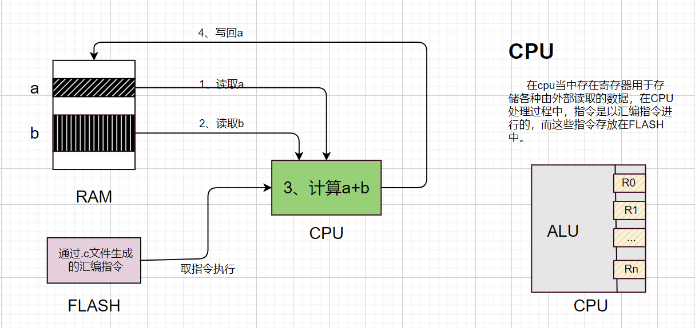

## 一、韦东山c语言加强

1、对于int、char等类型的数据，他们只要是可读可写，那么就是变量，在开发板当中将会被保存在内存RAM当中，但是对于常量，开发板将会将他们保存在FLASH中，以节省内存空间。但是有时编译器会根据变量大小进行调整存储的方案，可能一些小型的常量也会被保存在内存中。


2、int* char* struct*，不论是什么类型的指针p，所占据的内存大小永远都是4个字节，但是指针指向的数据所占用内存将根据数据本身决定。


> **3、对于volatile关键字:**

```c
int main()
{
    int i;
    
    volatile i = 1;  //对于该段代码可以省略，编译器将对其进行省略，但是使用volatile关键字可以使得编译器保留该段代码的操作
    i = 2;
    return 0;
}
```

使用volatile关键字将会使得程序的运行速度降低，因为对于使用它的变量，cpu每次访问必须要去ram单元，原本可能只用在cpu。一般来说在访问硬件寄存器时，就加上volatile关键字。


> **4、对于const关键字:**

放在开发板的flash单元，节省内存ram的容量，同时使得变量的值不被修改。


> **5、对于static关键字：**

static int a;  //标识变量a的作用范围只是在它所处的c文件中，但是如果是int a;的形式，将会使得a的作用范围变成整个程序,可能会导致多个文件中出现重复定义的错误发生。当出现多个同名变量时，在该c文件中，强龙不压地头蛇，优先使用static修饰的变量。


> **6、对于extern关键字：**

extern int a;只是声明，所以不能extern int a = 2;

指明变量是外部变量或者是外部函数，意思是该东西是外部定义的。在其它部分使用时，还需要加上申明int a;

如果在a.c中想使用b.c中的变量val，那么可以这么做：

在a.c中：

```c
#include 'b.h'
```

在b.h中:

```c
extern int val;  //这是声明
```

在b.c中：

```c
int val; //这是定义
```


> **7、struct结构体:**

```c
//定义，定义并不占据内存空间
struct person{
	char *name;
	int age;
}; 

struct company{
	char *name;
	struct person worker[100];
};

//实例化，此时才会分配空间
struct person wei = {"weidongshan" , 40};

//使用
printf(wei.name,wei.age);

//另外一种结构体的定义方法：
typedef struct person{
	char *name;
	int age;
}Person;

Person wei = {"weidongshan" , 40};
```


> **8、指针操作数据**

举例:写变量a的步骤  a = 1;隐含了地址的操作，

- 得到a的地址
- 得到需要写入的数据
- 将数据写入地址

- cpu读flash得到指令
- cpu执行指令

===============================

```c
int a = 1;

相当于以下的步骤：

int *p;

p = &a; // 取地址

*p = 1; //改变数值
```

================================

当然，上面是直接对变量a的地址进行操作，如果想要复制一个同样大小的内存空间操作，可以执行下面的步骤:

```c
int *p = malloc(sizeof(int));

*p = 1;

free(p);  //用完之后要用free()函数释放该内存空间，以免出现内存泄露的情况
```

================================

对于结构体指针：

```c
struct person{
	char *name;
	int age;
}; 

struct person wei = {"wei" , 40};

struct person *pt;

pt = &wei;

pt->age = 10; //结构体指针修改内部数据
```


> **9、结构体指针、函数指针**

```c
#include <stdio.h>

typedef struct student
{
    char *name;
    int age;
    struct student *classmate; // 同桌也是student结构体对象，这里使用指针来定义，不能用struct student classmate，这样会导致不断申请内存，无限套娃
    
} Student, *pstudent;


int main(void)
{   
	Student zhangsan = {"zhangsan" , 10 ,NULL};
    Student lili = {"Lili" , 10 ,NULL};

    zhangsan.classmate = &lili;
    lili.classmate = &zhangsan;
    
    return 0;
}
```

> 在结构体当中添加函数

```c
#include <stdio.h>

static void play_ball(void)
{
    printf("play ball");
}

static void singing(void)
{
    printf("singing");
}

typedef struct student
{
    char *name;
    int age;
    struct student *classmate; // 同桌也是student结构体对象，这里使用指针来定义，不能用struct student classmate，这样会导致不断申请内存，无限套娃
    
    //添加函数指针
    void (*hobby)(void);
    
} Student, *pstudent;


int main(void)
{   
	Student zhangsan = {"zhangsan" , 10 ,play_ball ,NULL};
    Student lili = {"Lili" , 10 ,singing ,NULL};

    zhangsan.classmate = &lili;
    lili.classmate = &zhangsan;
    
    return 0;
}
```

> **10、链表操作**

```c
#include <stdio.h>

typedef struct spy
{
    char *name;
    struct spy *next;
}spy, *p_spy;

spy A = {"A",NULL};
spy B = {"B",NULL};
spy C = {"C",NULL};

int main() {
    
    A.next = &B;
    B.next = &C;
    C.next = NULL;

    p_spy HEAD = &A;
    
    while (HEAD != NULL)
    {
        printf("%s\r\n",HEAD->name);
        HEAD = HEAD->next;
    }
    
    return 0;
}
```

> **11、ARM架构**

```c
#include <stdio.h>

int main()
{
    int a = 1;
    int b = 2;
    a = a + b;
    return 0;
}
```



> **12、几条汇编指令**

- load
- store
- B、BL
- add、sub
- and、bic

> **13、几个核心问题**

- 全局变量的初始化
- 局部变量在哪？
- 局部变量的初始化
- 栈的作用